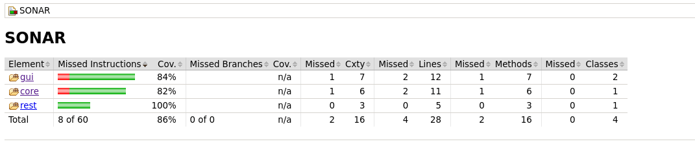

Sample project to demonstrate how to generate the JaCoCo report containing all modules of a parent project. The file jacoco.html (target/site/jacoco/index.html) is generated in each module, as well as, a report html file containning all the modules is created in `sonar/target/site/jacoco-aggregate/index.html`, as seen in the picture bellow:



Run the report:

```bash
mvn -P sonar
```
or

```bash
clean org.jacoco:jacoco-maven-plugin:prepare-agent install 
org.jacoco:jacoco-maven-plugin:report sonar:sonar
```

If you don't have sonarqube available locally just remove `sonar:sonar` from the command line.